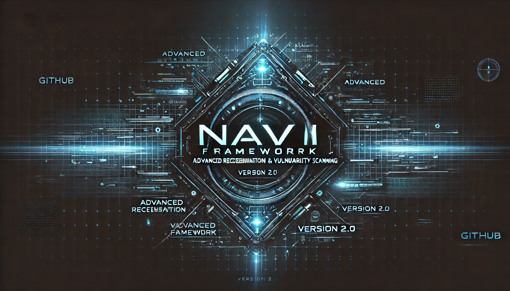

# 🛡️ Navi Framework

  

  
  
  
  

  A powerful, automated reconnaissance and vulnerability scanning framework designed for security researchers and penetration testers.

## 🚀 Features

- **Automated Reconnaissance**
  - Subdomain Enumeration
  - DNS Resolution
  - Web Service Discovery
  - Content Discovery

- **Security Scanning**
  - Vulnerability Assessment
  - Port Scanning
  - Technology Detection
  - Security Misconfiguration Checks

- **Enhanced Security**
  - Process Isolation
  - Rate Limiting
  - Secure File Handling
  - Audit Logging

- **Efficient Resource Management**
  - Parallel Processing
  - Session Management
  - Intelligent Retries
  - Progress Tracking

## 🛠️ Installation
bash
Clone the repository
git clone https://github.com/naviyanka/Navi-Framework.git
Navigate to directory
cd Navi-Framework
Make scripts executable
chmod +x .sh
Install dependencies
./install.sh

## 📋 Requirements

- Go 1.19+
- Bash 4.0+
- Root/sudo access (for some features)

## 🎯 Quick Start
bash
Basic scan
./naviconsole.sh -d example.com
Verbose mode
./naviconsole.sh -d example.com -v

## 🔧 Configuration

The framework can be configured through `config.conf`:

bash
Edit configuration
nano config.conf
Main settings
THREADS=10
TIMEOUT=30
RETRIES=3

## 🛡️ Security Features

- Process Isolation
- File Integrity Checking
- DNSSEC Validation
- Audit Logging
- Rate Limiting
- Access Control

## 📊 Example Output

plaintext
███╗ ██╗ █████╗ ██╗ ██╗██╗
████╗ ██║██╔══██╗██║ ██║██║
██╔██╗ ██║███████║██║ ██║██║
██║╚██╗██║██╔══██║╚██╗ ██╔╝██║
██║ ╚████║██║ ██║ ╚████╔╝ ██║
╚═╝ ╚═══╝╚═╝ ╚═╝ ╚═══╝ ╚═╝
[INFO] Starting reconnaissance for: example.com
[+] Found 150 subdomains
[+] Identified 89 live endpoints
[+] Discovered 3 potential vulnerabilities

## 📁 Directory Structure
plaintext
navi-framework/
├── naviconsole.sh # Main script
├── install.sh # Installation script
├── security_init.sh # Security initialization
├── config.conf # Configuration file
├── wordlists/ # Wordlist directory
├── results/ # Scan results
└── logs/ # Log files

## 🤝 Contributing

Contributions are welcome! Please feel free to submit a Pull Request.

1. Fork the repository
2. Create your feature branch (`git checkout -b feature/AmazingFeature`)
3. Commit your changes (`git commit -m 'Add some AmazingFeature'`)
4. Push to the branch (`git push origin feature/AmazingFeature`)
5. Open a Pull Request

## 📝 License

This project is licensed under the MIT License - see the [LICENSE](LICENSE) file for details.

## 🙏 Acknowledgments

- Thanks to all the amazing open-source tools that make this framework possible
- Special thanks to the security research community

## 📬 Contact

- GitHub: [@naviyanka](https://github.com/naviyanka)
- Twitter: [@naviyanka](https://twitter.com/naviyanka)

## ⚠️ Disclaimer

This tool is for educational purposes only. Ensure you have explicit permission to scan any systems or networks.

---

Made with ❤️ by Security Researchers for Security Researchers

